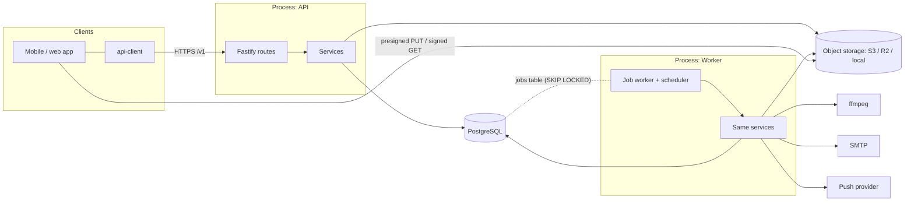
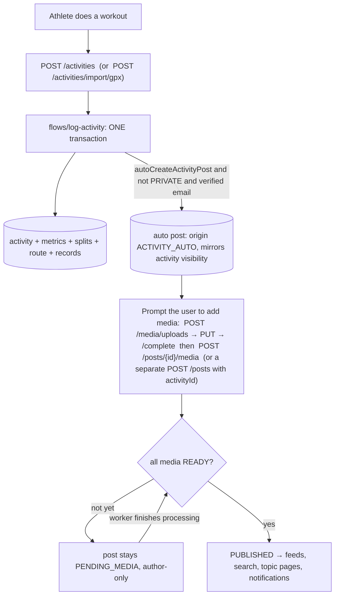

# Architecture

## In one paragraph

A **modular monolith**: one TypeScript codebase deployed as two processes from one image — the **API**
(Fastify) and the **worker** (the same code, no HTTP listener) — over a single **PostgreSQL**
database that also acts as the job queue, the search index and the analytics store. Business code is
split into bounded-context **modules**; infrastructure lives in **platform**; the few operations that
must span modules live in **flows**; and one file, `src/services.ts`, builds the whole dependency
graph. External services (object storage, email, push, content moderation, search) sit behind
**ports** with a development adapter and, where it exists, a production adapter.



Why this shape, and when to change it: [`DECISIONS.md`](DECISIONS.md).

## Layers and what may depend on what

```
config ◄── platform ◄── modules (leaf → identity → content → consumers) ◄── flows ◄── services.ts / routes.ts / jobs.ts
```

- **`src/platform/`** — infrastructure with no business rules: config, clock, ids (UUIDv7), errors,
  logging, request context, DB client/migrations/keyset helpers, HTTP helpers (cursors, error handler,
  rate limits, idempotency, OpenAPI tidy-up), the **job queue/worker/scheduler**, mail, storage
  (local + S3), crypto (password hashing, token hashing, sealing), metrics, and the **ports**
  (`content-moderation`, `push`, `event-recorder`). It imports nothing from `modules/`.
- **`src/modules/<name>/`** — a bounded context: a `service.ts` (rules), `routes.ts` (HTTP binding, no
  SQL) and helpers. Modules may depend only on the modules listed for them in the pinned table in
  [`test/architecture.test.ts`](../apps/api/test/architecture.test.ts) — adding an edge is a deliberate
  edit of that table. No cycles. Routes may import the `Services` _type_ from the composition root
  and nothing else from it.
- **`src/flows/`** — orchestration across modules that would otherwise need a cycle:
  `log-activity` (activity → auto-created post, one transaction) and `purge-account`.
- **Composition root** `src/services.ts` constructs every service in dependency order; `routes.ts`
  registers every module's routes under `/v1`; `jobs.ts` registers every job handler and schedule.

Adapters are isolated too: `pg`, `nodemailer`, `@aws-sdk/*`, `@node-rs/argon2`, `prom-client` are only
imported from `platform/`; `jose` only from `modules/auth`; the GPX XML parser only from
`modules/activities`; `child_process` (ffmpeg) only from `modules/media` — all enforced by the
architecture test.

## Module catalogue

| Module                       | Owns (tables)                                                                                                       | Responsibility                                                                                                                                                                                                 |
| ---------------------------- | ------------------------------------------------------------------------------------------------------------------- | -------------------------------------------------------------------------------------------------------------------------------------------------------------------------------------------------------------- |
| `users`                      | `users`                                                                                                             | Identity records, `UserDirectory` (compact user summaries with avatars), age rules, username policy                                                                                                            |
| `auth`                       | `sessions`, `refresh_tokens`, `auth_tokens`, `login_throttles`, `devices`, `oauth_identities`                       | Signup/login/refresh/logout, email verification, password reset/change, sessions & devices, account deletion requests; the auth guard plugin (`requireAuth`, `optionalAuth`, `requireVerified`, `requireRole`) |
| `profiles`                   | `profiles`, `user_settings`                                                                                         | Profile and settings, avatar                                                                                                                                                                                   |
| `social`                     | `follows`, `follow_requests`, `blocks`                                                                              | Follow / approve / block, follower lists, **the visibility predicates** (single source of truth for "can viewer V see X")                                                                                      |
| `sports`                     | `sports`, `sport_preferences`                                                                                       | Sport catalogue + capabilities (what metrics a sport supports)                                                                                                                                                 |
| `activities`                 | `activities`, `activity_metrics`, `activity_splits`, `activity_routes`, `activity_records`, `privacy_zones`         | Log/import (GPX) activities, metrics, personal records, **route privacy**, privacy zones                                                                                                                       |
| `integrations`               | `integration_connections`                                                                                           | Provider connection records (columns reserved for sealed tokens). No provider clients yet                                                                                                                      |
| `media`                      | `media_assets`, `video_assets`, `image_assets`, `media_variants`                                                    | Upload lifecycle, ffmpeg processing, signed delivery                                                                                                                                                           |
| `posts`                      | `posts`, `post_media`, `topics`, `post_topics`, `post_mentions`, `sponsorship_disclosures`                          | Posts of every kind, hashtags/mentions, **the hydrator** that turns rows into API `Post`s in a constant number of queries                                                                                      |
| `creators`                   | `creator_profiles`, `brand_partnerships`                                                                            | Creator/brand metadata and partnership records (verification itself is a _moderation_ action)                                                                                                                  |
| `engagement`                 | `post_reactions`, `comments`, `comment_reactions`, `comment_mentions`, `bookmarks`, `shares`                        | Reactions, two-level comments, bookmarks, shares                                                                                                                                                               |
| `notifier` / `notifications` | `notifications`, `notification_preferences`                                                                         | Write side (`Notifier.notify(…, trx)`) / read API, preferences, push fan-out job                                                                                                                               |
| `events`                     | `feed_events`                                                                                                       | Client event ingestion + server-side event recording                                                                                                                                                           |
| `feed`                       | `feed_requests`, `recommendation_events`, `feed_snapshots`, `post_stats`, `analytics_watermarks`, `user_affinities` | Following / Home / Explore feeds, ranking v1, serving log, analytics jobs                                                                                                                                      |
| `search`                     | – (uses indexes on `profiles`, `posts`, `topics`)                                                                   | `SearchProvider` port, Postgres implementation, re-authorising `SearchService`                                                                                                                                 |
| `discovery`                  | –                                                                                                                   | Who to follow, trending topics, topic pages                                                                                                                                                                    |
| `moderation`                 | `reports`, `moderation_actions`                                                                                     | Reports, automated flags, staff queue and actions, append-only audit trail                                                                                                                                     |
| `exports`                    | `data_exports`                                                                                                      | Personal data export (streamed JSON in object storage)                                                                                                                                                         |
| `dev`                        | `dev_mail_outbox`                                                                                                   | Dev-only mail outbox viewer (route absent unless `DEV_ENDPOINTS_ENABLED`)                                                                                                                                      |

Platform tables: `jobs`, `idempotency_keys`, `schema_migrations`. Column-level detail:
[`DATABASE.md`](DATABASE.md).

## Request lifecycle

```mermaid
sequenceDiagram
  participant C as Client
  participant F as Fastify
  participant A as Auth guard
  participant R as Rate limiter
  participant S as Service
  participant D as PostgreSQL
  C->>F: HTTP /v1/... (+ Authorization, X-Request-Id?)
  F->>F: request id (client's if well-formed, else UUIDv7)
  F->>A: onRequest: verify JWT, load session+user row
  A-->>F: request.auth {userId, role, emailVerified} (or 401/403)
  F->>R: preHandler: global per-IP + route profile (per-user or per-IP)
  F->>F: Zod validation (params/query/body) → 422 VALIDATION_FAILED
  F->>S: handler → service method
  S->>D: Kysely queries (visibility predicates in SQL)
  S-->>F: result (or AppError)
  F->>F: Zod response serialization; error handler → {error:{code,message,requestId}}
  F-->>C: JSON + X-Request-Id + Cache-Control: no-store
```

Two details that shape the code:

- **Authentication is checked against the database on every request.** The JWT only proves a session
  existed; liveness (logout, revocation, suspension, pending deletion) is read from `sessions ⋈ users`,
  so moderation and logout take effect immediately. Routes tagged `allowRestricted` (e.g. `/me`,
  logout, cancel deletion) still work for suspended / pending-deletion accounts.
- **Visibility is enforced in SQL, not remembered per endpoint.** Every query that returns someone
  else's content ANDs a predicate from `social/visibility.ts` / `posts/visibility.ts` /
  `search/predicates.ts`; single-resource lookups use the same predicates and answer **404, never 403**
  when the viewer is not allowed to know the thing exists.

## DO → LOG → SHOW in the code



Activities and posts are separate rows: a `PRIVATE` activity creates no post, deleting an activity
deletes its _auto_ post but only detaches _authored_ posts, and a post can exist without any activity
(creator videos, text, photos). `format` (`VIDEO > PHOTO > ACTIVITY > TEXT`) is **derived by the server**
from what the post contains so clients never have to guess a layout.

## Background work

One table-backed queue (`jobs`): `FOR UPDATE SKIP LOCKED` claiming, per-job `maxAttempts` with
exponential backoff, stale-lock reclaim after 15 minutes (a crashed worker's job is retried),
`dedupeKey` (skip while one is pending) and `uniqueKey` (cron buckets: N schedulers ⇒ one job per
bucket). Jobs are enqueued **in the same transaction** as the state change that needs them, so there is
no "committed but never queued" window. Handlers must be idempotent.

| Job                                              | Schedule             | Purpose                                                                                                 |
| ------------------------------------------------ | -------------------- | ------------------------------------------------------------------------------------------------------- |
| `media.process`                                  | on upload completion | Validate, transcode, extract poster/thumbnails, moderate, flip to READY/FAILED/REJECTED                 |
| `media.status_changed`                           | after processing     | Publish (or fail) posts that were waiting on that media; notify the author                              |
| `media.delete_objects`                           | on demand            | Delete stored files (post deleted, account purged, orphans removed)                                     |
| `media.cleanup`                                  | 15 min               | Drop abandoned upload slots; delete orphaned (never-attached) media after `MEDIA_ORPHAN_RETENTION_DAYS` |
| `email.send`                                     | on demand            | Send an email (tokens are **sealed** inside the payload, never stored in plaintext)                     |
| `notifications.push`                             | on demand            | Deliver a push for a stored notification                                                                |
| `feed.rollup_post_stats`                         | 5 min                | Fold `feed_events` into `post_stats` exactly once (watermark)                                           |
| `feed.refresh_affinities`                        | 5 min                | Recompute taste for users with new events                                                               |
| `feed.purge_analytics`                           | 6 h                  | Retention for events, serving log, expired snapshots                                                    |
| `posts.purge_deleted` / `comments.purge_deleted` | 6 h                  | Permanently remove soft-deleted rows after 30 days                                                      |
| `exports.build` / `exports.expire`               | on demand / 1 h      | Build a personal data export / delete expired ones                                                      |
| `accounts.purge_due`                             | 15 min               | Permanently delete accounts whose deletion grace period ended                                           |
| `auth.purge_expired`                             | 1 h                  | Expired tokens, sessions, throttles, idempotency keys                                                   |
| `platform.purge_finished_jobs`                   | 1 h                  | Keep `jobs` small                                                                                       |

In development the worker runs inline in the API process; in production run `node dist/worker.js`
(one or more replicas, scale on queue depth — media processing is CPU-heavy, see
[`MEDIA_PIPELINE.md`](MEDIA_PIPELINE.md#scaling)).

## Ports (the swap points)

| Port                 | Default adapter                          | Production adapter                                   | Where                           |
| -------------------- | ---------------------------------------- | ---------------------------------------------------- | ------------------------------- |
| `ObjectStorage`      | `LocalStorage` (disk + HMAC-signed URLs) | `S3Storage` (S3 / R2 / MinIO)                        | `platform/storage`              |
| `Mailer`             | `ConsoleMailer` (dev outbox table)       | `SmtpMailer` (nodemailer)                            | `platform/mail`                 |
| `PushProvider`       | `LoggingPushProvider` (logs only)        | **none yet** (APNs / FCM / Expo to be written)       | `platform/ports/push.ts`        |
| `ContentModerator`   | `KeywordModerator` (word lists)          | **none yet** (plug a classifier)                     | `platform/ports/`               |
| `ModerationFlagSink` | `DbFlagSink` (files automated reports)   | same                                                 | `modules/moderation/flags.ts`   |
| `EventRecorder`      | `DbEventRecorder`                        | same                                                 | `modules/events/db-recorder.ts` |
| `SearchProvider`     | `PostgresSearchProvider`                 | Meilisearch / Typesense / OpenSearch (to be written) | `modules/search`                |

`createServices(platform, overrides)` accepts replacements for `mailer`, `storage`, `moderator`,
`push` and `search` — that is how tests inject fakes and how a real provider is wired in.

## Cross-cutting patterns

- **Contracts first.** Zod schemas in `packages/contracts` define every request/response and enum. The
  API validates with them, OpenAPI is generated from the registered routes, and `api-client` types are
  generated from that OpenAPI — so a drifting endpoint breaks a build, not a screen. CI fails if the
  committed `docs/openapi.json`, `docs/API_REFERENCE.md` or client types are stale.
- **One error shape** `{ error: { code, message, requestId, details? } }` with a closed catalogue of
  codes (`packages/contracts/src/errors.ts`).
- **Counters are maintained by triggers** using relative increments (`count = count + 1`), so
  concurrent likes/comments can never lose or double-count. Tests fire concurrent requests.
- **Pagination** is keyset (or snapshot for ranked feeds, or capped offset for search) with
  microsecond-precision timestamp cursors — see [`API.md`](API.md#pagination).
- **N+1 is a test failure**: hydrators load a whole page in a constant number of queries, and
  `query-budget` / feed tests assert it.
- **Time and randomness are injected** (`Clock`, `ManualClock`), which is what makes expiry, throttling
  and retention testable.
- **Observability**: pino JSON logs with a request id on every line and credential redaction;
  Prometheus metrics at `/metrics` (HTTP latency, job outcomes, auth events, pool stats), `/healthz`
  (liveness) and `/readyz` (database + migrations).
